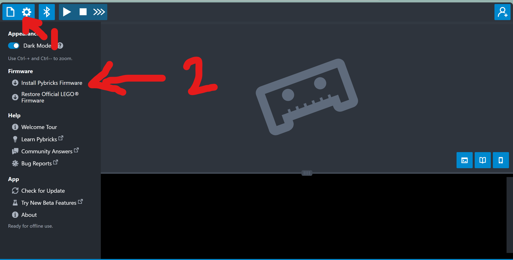
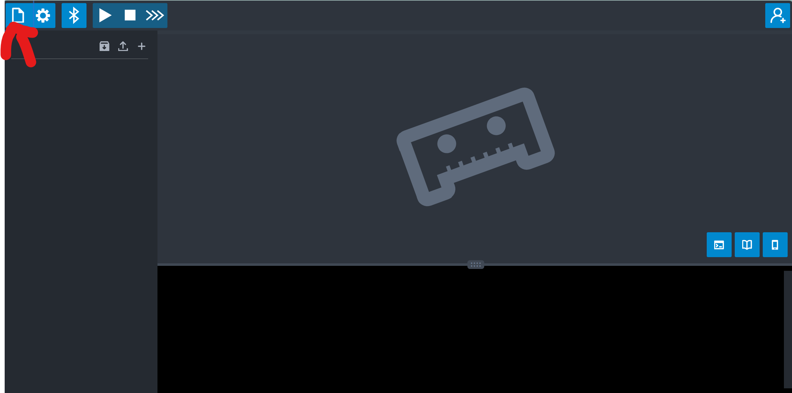
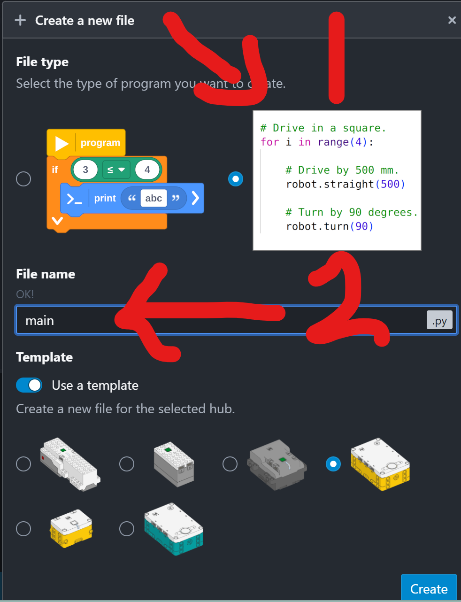

# A. Welcome to the WRO {.sdaia-dark background-gradient="linear-gradient(135deg, #1C355E, #00C9A7)"}

The **World Robot Olympiad** — robots that think for themselves.

## Hands up! ✋

Stand up or hands up — **who has…**

::: {.incremental}
- 🧱 …built something out of LEGO?
- 💻 …written a line of code?
- 🤖 …watched a robot competition — live?
:::

::: {.fragment .fade-up}
::: {.cardbox .teal}
By the end of today you'll have built a **real competition robot** with your own hands — and switched it on. The code starts next session.
:::
:::

## Robots that think for themselves

:::: {.columns}

::: {.column width="55%"}
- Teams **build and program a robot** that solves missions all on its own.
- Every year: a **brand-new mission** — nobody starts with last year's answers.
- Win here → national final → the **world** final.
:::

::: {.column width="45%"}
::: {.cardbox .teal}
**Our category**

**RoboMission · Elementary** — the robot drives a mission on a printed mat, on a real competition table.
:::
:::

::::

## Watch a real run {background-color="#1C355E"}



::: {style="font-size: 0.6em; opacity: 0.8;"}
WRO 2026 Elementary — the *Robot Rockstars* field. In five weeks, this is your table. ([watch on YouTube](https://www.youtube.com/watch?v=GTALL5YvmYs))
:::

::: {.notes}
YouTube refuses to play when the rendered HTML is opened straight from disk (file:// → "Error 153"). Present via `quarto preview` or any local HTTP server and it plays fine; the caption link is the in-room fallback.
:::

## Quick quiz 🚨

::: {.qbox}
[Your robot is mid-run — and it's heading straight off the table. What can you do?]{.qtitle}

Grab it? Shout "STOP"? Grab a joystick?
:::

::: {.fragment .fade-up}
::: {.cardbox .coral}
**Nothing.** You press **one start button** — after that, the robot is completely alone. Everything it does comes from the **code you wrote**.
:::
:::

::: {.fragment}
- Each run: at most **2 minutes** · robot starts inside a **25 × 25 × 25 cm box**.
:::

## This year's stage: *Robot Rockstars* 🎸

The robot sets up a concert — all by itself:

- 🥁 **Set up the instruments** on stage
- 🔌 **Plug in the cables**
- 🎤 **Deliver the microphone** to the singer
- 🔊 **Don't bump the speakers** — careful driving counts
- 🎵 **Crack the color notes** — new positions every round, so the robot must *look and decide*

::: {.fragment .fade-up}
**Vote:** which one sounds hardest? 🗳️
:::

## One more twist — the Surprise Rule 🎁 {.sdaia-dark background-gradient="linear-gradient(135deg, #1C355E, #625D9C)"}

::: {.cardbox}
On competition morning, judges may reveal a **surprise** — a new task or a changed rule. Teams reprogram **on the spot**.
:::

That's why we *understand* our code — never memorize it. **Every team member can explain the whole robot. No "that's my partner's part."**

## Five weeks, five new powers

| Week | Your robot learns to… |
|:--:|---|
| **1** | Build, drive straight, and sense |
| **2** | Score its first missions · teams of 2 form |
| **3** | Chain everything into **one big run** |
| **4** | Do it **every single time** |
| **5** | Sense color — and **compete** |

::: {.fragment .fade-up}
A run that works **every time** beats a fancy one that sometimes doesn't. You leave with real **Python**, a robot **you** built, and a **certificate**.
:::

# B. The Bench {.sdaia-dark background-gradient="linear-gradient(135deg, #1C355E, #FF7A5C)"}

Before we touch a brick — know your workspace.

## Bench rules

- 🔋 **USB-C charging** — hubs charge by cable; know where yours lives.
- 🗂️ **Sort your parts** into the tray — a lost axle stops a build.
- 🤖 **One student, one robot** — today everyone builds their **own**.
- 🔌 **No internet connection** — wireless is off at competition, so we practice that way from day one.

::: {.callout-tip}
## Bench tour
Find the charging station, the parts bins, the mat, and the return tray — *before* your hands touch a brick.
:::

# C. Build a GREAT Base {.sdaia-dark background-gradient="linear-gradient(135deg, #1C355E, #9B8EC0)"}

The LEGO Education **Advanced Driving Base** — today's main event.

## The build — 4 modules, one robot

- The base splits into **4 sub-assemblies** — build them one at a time, then **snap them together**.
- **2 large motors** drive the wheels · **2 medium motors** run tools · **2 color sensors** see the mat.
- Follow the **official LEGO instructions**, page by page — no freestyling on day one.
- Plan for **2–3 hours**. That's normal — this is a real competition chassis, not a toy set.

::: {.callout-note}
## The instructions
[LEGO Education — *Assembling an Advanced Driving Base*](https://education.lego.com/en-us/lessons/prime-competition-ready/assembling-an-advanced-driving-base/) — building-instruction booklets for every sub-assembly.
:::

::: {.notes}
Showpiece hook: you may show Droid Bot IV as a first-day "wow" — it's a hook only; we clone the Advanced Driving Base, not the droid. The full coach resource is the parent unit: https://education.lego.com/en-us/lessons/prime-competition-ready/ (Training Camps 1–3, My Code Our Program, Time for an Upgrade). Coach builds this same base as the gold reference.
:::

## Pace yourself — module checkpoints 🏁

| Checkpoint | You should have… |
|:--:|---|
| ☑ 1 | Drive module — both large motors mounted |
| ☑ 2 | Wheels on — it rolls when you push it |
| ☑ 3 | Tool motors + sensors attached |
| ☑ 4 | Hub seated, all cables clicked in |

::: {.callout-tip}
## Lightning Builder ⚡
A **bonus** for the first finishers whose robot passes the quality checks — a carrot, not a cutoff. If you don't finish today, you finish in tomorrow's warm-up. No penalty.
:::

## What makes a base GREAT?

Before you call it done, run the **four checks**:

::: {.incremental}
- 🔌 **Click check** — every cable pushed in until it *clicks*, routed away from the wheels.
- 🪞 **Twin check** — left side mirrors right. Compare with the booklet, not your memory.
- 🫨 **Shake check** — lift it, shake gently: nothing rattles, nothing drops.
- 🛞 **Roll check** — push it across the mat: rolls straight, nothing drags.
:::

::: {.fragment .fade-up}
::: {.cardbox .teal}
A base that passes all four beats a fancy one that loses a wheel mid-run.
:::
:::

## 6 ports, 6 jobs {.sdaia-dark background-gradient="linear-gradient(135deg, #1C355E, #625D9C)"}

::: {.callout-important}
## The hub has only 6 ports — and we use every one
**A** left drive · **E** right drive · **C/D** tool motors · **B/F** color sensors. No port left over — so no distance sensor. Later, you'll learn a cooler trick: the **motors themselves** can feel a wall.
:::

- Plug each cable into its **exact port** from the start — the code we write all season expects this map.

# D. Power On! {.sdaia-dark background-gradient="linear-gradient(135deg, #1C355E, #00C9A7)"}

Your robot's first breath.

## Install Pybricks first 🧑‍💻

Before the hub can run our Python, it needs new firmware — **Pybricks**.

::: {.callout-note}
## The editor
[code.pybricks.com](https://code.pybricks.com) — the browser code editor we use all season. No install, no account. Bookmark it.
:::

1. Open **code.pybricks.com**.
2. Click the **⚙️ gear icon** → **Install Pybricks Firmware**.
3. Plug the hub in by USB-C when asked, and wait for the progress bar to finish.

{fig-align="center" width="85%"}

## Open the file panel

Click the **file icon** (top-left) to open the file panel — this is where every program you write all season will live.

{fig-align="center" width="85%"}

## Create your first file

Click **+**, choose **program**, name it **main**, pick your hub, then **Create** — Pybricks drops in a starter template.

{fig-align="center" width="65%"}

::: {.fragment .fade-up}
::: {.cardbox .teal}
One hub, one `main.py` — the file the coach's D1 program runs from today, and the file **you** write into starting next session.
:::
:::

## Bring it to life

1. **Charge check** — plug in USB-C; the battery light tells the truth.
2. **Press the center button** — hold until the light comes on.
3. **Watch the status light** — that blink is the hub saying *"I'm alive, give me a program."*
4. **Connect by cable** to the laptop — hear it **beep**. 🔊

::: {.fragment .fade-up}
::: {.cardbox .teal}
That beep is a **program** — a few lines of Python that the coach sent to *your* robot. Next session, **you** write it.
:::
:::

::: {.notes}
Coach prep: hubs must be flashed with Pybricks firmware (code.pybricks.com) before or during D1 — budget time for it. The beep "proof of life" is `d01_power_on.py` from the repo root, run over the USB cable, one hub at a time. Let each student press the button themselves — the moment matters more than the minutes it costs.
:::

# E. The Gate {.sdaia-dark background-gradient="linear-gradient(135deg, #1C355E, #FF7A5C)"}

Build it. Check it. Wake it up.

## Today's gate

::: {.callout-important}
## You're done today when…
Your base **passes the four checks**, every cable is in the **right port**, and your hub **powers on and beeps**.
:::

::: {.fragment .fade-up}
Next session — *Make It Move*: your first race, your first program, and what **speed** really is — measured on your own robot.
:::

## Tonight's mission 🎬 {.sdaia-dark background-gradient="linear-gradient(135deg, #1C355E, #FF7A5C)"}

::: {.r-fit-text}
You built a robot today.
:::

**Optional at home:** WRO-Learn — [*Fundamentals of Mechanics*](https://wro-learn.org/en_us/course/48) (short videos — pure enrichment; everything you need is delivered in class).
