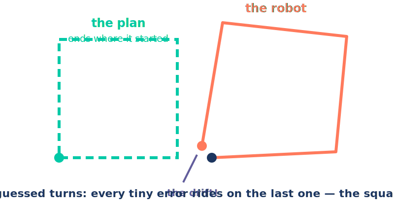
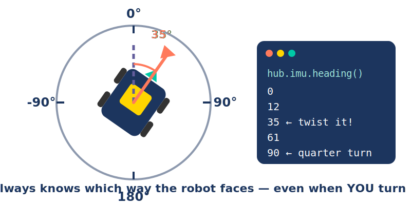

# A. Warm-Up {.sdaia-dark background-gradient="linear-gradient(135deg, #1C355E, #00C9A7)"}

Yesterday you taught it *distance*. Today it learns *direction* — and **you** build the steering yourself.

## Where we left off

| Yesterday | The trick |
|---|---|
| 📏 **Distance** | count **degrees** — 1 turn = **27.6 cm** |
| 🧭 **Blindfolded** | no checking → it **drifts** |

::: {.fragment .fade-up}
🤔 It knows how far its *wheels* spun. But which way is it **pointing**?
:::

⏱️ **Time: 10 minutes**

## Setup — same as yesterday

```{.python code-line-numbers="|1-4|6-8"}
from pybricks.hubs import PrimeHub
from pybricks.pupdevices import Motor
from pybricks.parameters import Port, Direction
from pybricks.tools import wait

hub = PrimeHub()
left = Motor(Port.A, Direction.COUNTERCLOCKWISE)
right = Motor(Port.E)
```

::: {.notes}
Everyone types this once at the top and keeps it for the whole day. Raw motors only, on purpose — through D9 the students *build* the whole driver and library by hand; the polished shortcut (`DriveBase`) waits until the D10 reveal (decision #20), a reward earned piece by piece.
:::

# B. Break It {.sdaia-dark background-gradient="linear-gradient(135deg, #1C355E, #FF7A5C)"}

Distance is solved. So ask for the one shape that needs **four good turns**: a square.

## One corner = how many degrees? 🤔

::: {.qbox}
[A side is easy: 30 cm → **391°**. But when the robot **spins in place**, how far does each wheel *roll*?]{.qtitle}

Watch the wheels from above — what shape do they draw?
:::

::: {.fragment .fade-up}
Sketch it. **Write down a wheel-degrees guess.** 👀
:::

::: {.notes}
Pure prediction — do NOT derive or reveal anything here. Collect shape guesses (a line? a spiral? a circle?) and a wheel-degrees number from every squad on the board; wrong guesses make the next slide land harder. The derivation happens *after* the demo's traces give the shape away. Do NOT mention slip or scrub anywhere in this act — the math is honest, and the square is about to betray it anyway. That betrayal lands harder if they trust the number when it arrives.
:::

## The wheels answer: the turn-circle 🛞

```{=html}
<div style="display:flex;justify-content:center;align-items:center;gap:55px;">
  <svg width="310" height="310" viewBox="-125 -125 250 250" xmlns="http://www.w3.org/2000/svg">
    <circle id="tcCircle" r="57" fill="#eef3f8" stroke="#1C355E" stroke-width="2.5" stroke-dasharray="7 7" opacity="0.9"/>
    <polyline id="tcTraceR" points="" fill="none" stroke="#00C9A7" stroke-width="5" stroke-linecap="round"/>
    <polyline id="tcTraceL" points="" fill="none" stroke="#FF7A5C" stroke-width="5" stroke-linecap="round"/>
    <g id="tcBot">
      <rect id="tcBody" x="-41" y="-40" width="82" height="80" rx="11" fill="#1C355E"/>
      <rect id="tcTireR" x="51" y="-17" width="12" height="34" rx="4" fill="#00C9A7"/>
      <rect id="tcTireL" x="-63" y="-17" width="12" height="34" rx="4" fill="#FF7A5C"/>
      <rect x="-14" y="-14" width="28" height="28" rx="5" fill="#FFD500"/>
      <polygon points="0,-54 -10,-38 10,-38" fill="#00C9A7"/>
    </g>
    <text id="tcArcLbl" text-anchor="middle" font-size="15" font-weight="700" fill="#00AE8D" opacity="0"></text>
  </svg>
  <div style="text-align:left;">
    <div style="font-family:Consolas,monospace;font-size:22px;color:#1C355E;background:#eef3f8;border-radius:10px;padding:12px 20px;">
      robot turned: <span id="tcRobot" style="font-weight:800;color:#625D9C;">0</span>&#176;<br>
      tire rolled: <span id="tcArc" style="font-weight:800;color:#00AE8D;">0.0</span> cm &#8594; <span id="tcWheel" style="font-weight:800;color:#E96852;font-size:26px;">0</span>&#176;
    </div>
    <div style="font-family:Consolas,monospace;font-size:18px;color:#1C355E;margin-top:10px;line-height:1.9;">
      <div class="fragment">rope around the circle = 3.14 &#215; <span id="tcGap" style="font-weight:700;">14.5</span> &#8776; <b><span id="tcRope">45.5</span> cm</b></div>
      <div class="fragment">one corner = rope &#247; 4 &#8776; <b style="color:#00AE8D;"><span id="tcQuarter">11.4</span> cm</b> of rolling</div>
      <div class="fragment">&#215; 13.04 <span style="opacity:0.7;">(yesterday's translator)</span> &#8594; TURN_ANGLE &#8776; <span id="tcTA" style="font-weight:800;color:#E96852;font-size:22px;">148</span>&#176;</div>
    </div>
    <div style="display:flex;gap:12px;margin-top:14px;">
      <button onclick="tcTurn(90)" style="background:#00C9A7;color:#fff;border:none;border-radius:10px;padding:9px 16px;font-size:20px;font-weight:700;cursor:pointer;">&#9654; Turn 90&#176;</button>
      <button onclick="tcTurn(180)" style="background:#FF7A5C;color:#fff;border:none;border-radius:10px;padding:9px 16px;font-size:20px;font-weight:700;cursor:pointer;">&#9654; Turn 180&#176;</button>
      <button onclick="tcReset()" style="background:#625D9C;color:#fff;border:none;border-radius:10px;padding:9px 16px;font-size:20px;font-weight:700;cursor:pointer;">&#8634; reset</button>
    </div>
    <div style="font-size:19px;color:#1C355E;margin-top:14px;">
      tire gap: <b><span id="tcTrackVal">14.5</span> cm</b><br>
      <input type="range" min="9" max="16" step="0.1" value="14.5" oninput="tcTrack(this.value)" style="width:230px;accent-color:#1C355E;">
    </div>
  </div>
</div>
<script>
(function(){
  var theta = 0, target = 0, raf = null, track = 14.5, lastInc = 90;
  var ptsR = [], ptsL = [];
  function el(id){ return document.getElementById(id); }
  function R(){ return track*10/2; }
  function setGeom(){
    var r = R();
    el('tcCircle').setAttribute('r', r);
    el('tcTireR').setAttribute('x', r-6);
    el('tcTireL').setAttribute('x', -r-6);
    el('tcBody').setAttribute('x', -(r-16));
    el('tcBody').setAttribute('width', 2*(r-16));
  }
  function draw(){
    el('tcBot').setAttribute('transform','rotate('+theta.toFixed(1)+')');
    var arc = theta/360*3.14*track;
    el('tcRobot').textContent = Math.round(theta);
    el('tcArc').textContent = arc.toFixed(1);
    el('tcWheel').textContent = Math.round(arc*13.04);
  }
  function sample(){
    var r = R(), a = theta*Math.PI/180;
    ptsR.push((r*Math.cos(a)).toFixed(1)+','+(r*Math.sin(a)).toFixed(1));
    ptsL.push((-r*Math.cos(a)).toFixed(1)+','+(-r*Math.sin(a)).toFixed(1));
    el('tcTraceR').setAttribute('points', ptsR.join(' '));
    el('tcTraceL').setAttribute('points', ptsL.join(' '));
  }
  function showLbl(){
    var r = R()+24, a = (target - lastInc/2)*Math.PI/180;
    var t = el('tcArcLbl');
    t.setAttribute('x',(r*Math.cos(a)).toFixed(1));
    t.setAttribute('y',(r*Math.sin(a)+5).toFixed(1));
    t.textContent = (lastInc === 180 ? '½' : '¼') + ' rope ≈ ' + (3.14*track*lastInc/360).toFixed(1) + ' cm';
    t.setAttribute('opacity','1');
  }
  function animate(){
    if(raf) cancelAnimationFrame(raf);
    var start = theta, t0 = performance.now(), dur = 1300;
    function step(now){
      var p = Math.min((now-t0)/dur, 1);
      var e = p<0.5 ? 2*p*p : -1+(4-2*p)*p;
      theta = start + (target-start)*e;
      sample(); draw();
      if(p<1){ raf = requestAnimationFrame(step); } else { theta = target; draw(); showLbl(); raf = null; }
    }
    raf = requestAnimationFrame(step);
  }
  window.tcTurn = function(deg){ el('tcArcLbl').setAttribute('opacity','0'); target += deg; lastInc = deg; animate(); };
  window.tcReset = function(){
    if(raf) cancelAnimationFrame(raf); raf = null;
    theta = 0; target = 0; ptsR = []; ptsL = [];
    el('tcTraceR').setAttribute('points','');
    el('tcTraceL').setAttribute('points','');
    el('tcArcLbl').setAttribute('opacity','0');
    draw();
  };
  window.tcTrack = function(v){
    track = parseFloat(v);
    el('tcTrackVal').textContent = track.toFixed(1);
    el('tcGap').textContent = track.toFixed(1);
    el('tcRope').textContent = (3.14*track).toFixed(1);
    el('tcQuarter').textContent = (3.14*track/4).toFixed(1);
    el('tcTA').textContent = Math.round(3.14*track/4*13.04);
    window.tcReset(); setGeom();
  };
  setGeom(); draw();
})();
</script>
```

::: {.fragment .fade-up}
::: {.cardbox .teal}
That gap has a name: the **axle track** — the wheel-to-wheel distance, **≈ 14.5 cm** on our base. Wider robot → longer rope → bigger corner. **Measure your own** — nobody copies 148.
:::
:::

::: {.notes}
This is the reveal for the last slide's question — click BEFORE explaining. Hit **Turn 90°** with their guesses on the board: both tires drag a quarter of the dashed circle, the shape question answers itself on screen, and the **¼ rope ≈ 11.4 cm** label lands right on the arc they just watched. Now the three formula lines, one fragment at a time, each reading its number off the picture: rope around the circle (3.14 × gap) — say it as yesterday's move: "rope around the *rim* gave you 27.6; same trick, bigger circle, drawn on the mat" — then a quarter of it (the labeled arc), × 13.04 → 148, next to their guesses. Don't re-teach the translator — 13.04 is yesterday's number; a quick "who remembers what 13.04 does?" is enough. Click three more times: a full robot-turn = the whole circle's rope. Save the **Turn 180°** button for the about-face slide two slides ahead — it shows ½ rope live and confirms ≈297. Then the payoff: drag the **tire gap** slider wider — every line updates live and TURN_ANGLE grows. Wider robot = more rolling per corner — *that's* why every squad measures their **own** gap (≈145 mm on our build; the stock ADB is ≈114 mm). Teal trace = right tire, coral = left, same colors as the code comments.
:::

## Unroll the formula 🧵

Your 148 is right. But every number is one of **yesterday's ropes** — unroll them, and watch π vanish:

```{=html}
<div style="font-family:Consolas,monospace;font-size:23px;color:#1C355E;background:#eef3f8;border-radius:12px;padding:16px 26px;line-height:2.1;width:fit-content;margin:0 auto;">
  <div>TURN_ANGLE&nbsp;= 3.14 × 14.5 ÷ 4&nbsp;&nbsp;× <span style="color:#625D9C;font-weight:700;">13.04</span></div>
  <div class="fragment">&nbsp;&nbsp;&nbsp;&nbsp;&nbsp;&nbsp;&nbsp;&nbsp;&nbsp;&nbsp;&nbsp;= 3.14 × 14.5 ÷ 4&nbsp;&nbsp;× <span style="color:#625D9C;font-weight:700;">360 ÷ (3.14 × 8.8)</span></div>
  <div class="fragment">&nbsp;&nbsp;&nbsp;&nbsp;&nbsp;&nbsp;&nbsp;&nbsp;&nbsp;&nbsp;&nbsp;= <s style="color:#E96852;">3.14</s> × 14.5 × <b>90</b> ÷ (<s style="color:#E96852;">3.14</s> × 8.8)</div>
  <div class="fragment">&nbsp;&nbsp;&nbsp;&nbsp;&nbsp;&nbsp;&nbsp;&nbsp;&nbsp;&nbsp;&nbsp;= <b>90 × 14.5 ÷ 8.8 ≈ 148°</b></div>
</div>
```

::: {.fragment .fade-up}
::: {.cardbox .teal}
**TURN_ANGLE = turn × gap ÷ wheel.** The two 3.14s *cancel*. Keep **gap** and **wheel** in your pocket… 😏
:::
:::

::: {.notes}
Act 3 of the turn-circle story: question → wheels answer → unroll the answer. Elicit the substitution, don't re-teach it — both ropes are Day-2 property: "what IS 13.04?" (360 ÷ 27.6) and "what was 27.6?" (3.14 × 8.8, the wheel's rope). The only NEW thing on this slide is the cancellation: same 3.14 on top and bottom → cancels; 360 ÷ 4 → 90. What's left is 90 × gap ÷ wheel: sanity-check on the calculator, 90 × 14.5 ÷ 8.8 = 148.3 ≈ their 148. The pocket line is a deliberate plant: **gap and wheel diameter are exactly the two numbers `DriveBase` asks for on Day 5** — when that deck asks "why does it need the axle track?", call back to this cancellation. Land at least the final gap ÷ wheel line with everyone; if a squad is drowning in the algebra, the demo intuition carries the load — skim the middle steps and move on.
:::

## Prove you own it: the about-face 🔄

::: {.qbox}
[Judge wants a full **180° about-face**. In `turn × gap ÷ wheel` — which number changes?]{.qtitle}

Say it first, *then* calculate.
:::

::: {.fragment .fade-up}
```{=html}
<div style="font-family:Consolas,monospace;font-size:23px;color:#1C355E;background:#eef3f8;border-radius:12px;padding:16px 26px;line-height:2.1;width:fit-content;margin:0 auto;">
  <div>corner:&nbsp;&nbsp;&nbsp;&nbsp;&nbsp;<span style="color:#625D9C;font-weight:800;">90</span> × 14.5 ÷ 8.8 ≈ <b>148°</b></div>
  <div>about-face: <span style="color:#E96852;font-weight:800;">180</span> × 14.5 ÷ 8.8 ≈ <b style="color:#E96852;">297°</b></div>
</div>
```
:::

::: {.fragment .fade-up}
::: {.cardbox .teal}
Only the **turn** changed — half the rope, so ≈ **double**. Gap and wheel = your robot's fingerprint. The turn = your order.
:::
:::

::: {.notes}
This is the payoff of the unroll: the formula *generalizes*. Elicit before revealing — most squads will say "the 90 becomes 180"; make them commit, then show the line. If anyone doubts it, flip back two slides and hit **Turn 180°** on the turn-circle demo: the label shows **½ rope ≈ 22.8 cm** and the tire counter lands on ≈297 — the picture and the formula agree. Fast squads: ask for the octagon corner (45° → 45 × 14.5 ÷ 8.8 ≈ 74°) — they'll need it after the loop slide. Every squad substitutes **their own** measured gap, not 14.5.
:::

## The square — by hand

```{.python code-line-numbers="|1-3|5-6|7-8|10"}
SIDE_ANGLE = 391    # 30 cm × 13.04 — yesterday's translator
TURN_ANGLE = 148    # YOUR number — ¼ turn-circle, translated. Honest math!
SPEED = 400         # deg/s

left.run_angle(SPEED, SIDE_ANGLE, wait=False)    # side 1
right.run_angle(SPEED, SIDE_ANGLE)
left.run_angle(SPEED, TURN_ANGLE, wait=False)    # corner 1 — wheels roll opposite ways…
right.run_angle(SPEED, -TURN_ANGLE)              # …so the robot spins in place

# your turn: copy-paste until you have 4 sides + 4 corners
```

Run it. A square! …ish. Hold your corner questions — first, a **code** smell. 👃

::: {.notes}
Let them build it the obvious way: select the four motor lines, copy, paste ×3. It runs, and something square-ish appears — do NOT investigate the corners yet; that's the next act. This slide is about the *program*: ~16 near-identical lines. Watch for squads that miss a paste or drop a minus sign — those bugs are teaching gold for the quiz that follows.
:::

## Quick quiz 🚨

::: {.qbox}
[Your square = ~16 copy-pasted lines. Now the judge wants an **octagon**. Then a triangle. How many lines each time?]{.qtitle}

Would you bet a competition run on 32 pasted lines?
:::

::: {.fragment .fade-up}
::: {.cardbox .coral}
**32 pasted lines** — one flipped minus sign from a broken corner. Repeating yourself breeds bugs. Repeats are the **computer's** job.
:::
:::

## The rescue: repeat with `for`

```{.python code-line-numbers="|1|2"}
for side in range(4):            # do the indented lines 4 times
    print("side number", side)
```

- Run it: prints **0, 1, 2, 3** — computers start counting at 0.
- Everything **indented** under the `for` is *inside* the loop.

::: {.fragment .fade-up}
::: {.cardbox .teal}
`range(4)` = "**4 times.**" Write it once, repeat it. A square = *one corner, four times*.
:::
:::

## 🐛 Bug hunt: the missing colon

::: {.qbox}
[This `for` loop won't even start — Pybricks flags the **first line** in red. What's missing?]{.qtitle}
:::

```python
for side in range(4)
    left.run_angle(SPEED, SIDE_ANGLE, wait=False)
    right.run_angle(SPEED, SIDE_ANGLE)
```

::: {.fragment .fade-up}
::: {.cardbox .coral}
`SyntaxError` — no **colon**. Every repeat header ends in `:` — it says *"block starts here."* Fix: `for side in range(4):`
:::
:::

::: {.notes}
The colon is invisible until it's missing — run it live so the red SyntaxError lands on the `for` line. Make the habit loud: say "colon" out loud every time you type a `for` or `while` header this week. This is the #1 typo of the day; naming it now saves ten rescues later.
:::

## 🐛 Bug hunt: the runaway line

::: {.qbox}
[The colon's there now… and it *still* won't run. Read the error — it points at **line 2.**]{.qtitle}
:::

```python
for side in range(4):
left.run_angle(SPEED, SIDE_ANGLE, wait=False)
right.run_angle(SPEED, SIDE_ANGLE)
```

::: {.fragment .fade-up}
::: {.cardbox .coral}
`IndentationError` — lines inside a loop must be **pushed in** (one Tab). No indent, no "inside." The spaces tell Python what repeats.
:::
:::

::: {.notes}
Indentation-as-meaning is the single biggest beginner hurdle — spend a beat. Show both side by side: flush-left (crashes) vs. indented (runs). Then the sneaky version if time allows: indent **only** line 2 — no crash, but the right wheel fires once, outside the loop. "It ran but it's wrong" is scarier than a crash, and that's exactly the lesson.
:::

## The square — one corner, four times

```{.python code-line-numbers="|1-3|5-9"}
SIDE_ANGLE = 391    # same constants as before…
TURN_ANGLE = 148
SPEED = 400

for side in range(4):
    left.run_angle(SPEED, SIDE_ANGLE, wait=False)    # counted → sides are solid
    right.run_angle(SPEED, SIDE_ANGLE)
    left.run_angle(SPEED, TURN_ANGLE, wait=False)    # wheels roll opposite ways…
    right.run_angle(SPEED, -TURN_ANGLE)              # …so the robot spins in place
```

~16 lines → 8. Octagon? `range(8)` + one new corner number — **two edits**.

Now mark your start with tape. Run it **three times**. **Where does it finish?**

::: {.notes}
Close the octagon promise fast: `range(8)` plus a 45° corner — 45 × 14.5 ÷ 8.8 ≈ 74° — two edits, and a fast squad can try it. Sides use `run_angle` — yesterday's tool — so the four sides come out even and repeatable. That's deliberate: it isolates the failure to the *turns*. And the 148 is *their* honest math from this morning, so nobody can blame the number — tires scrub and slip in a pivot, so 148 wheel-degrees ≠ 90 robot-degrees, and it varies run to run. Let them run 3× and watch the last corner miss the tape by a *different* amount each time.
:::

## The square that never closes

{fig-align="center" width="85%"}

::: {.fragment .fade-up}
::: {.cardbox .coral}
The wheels really *did* roll 148° — your math was right.

But a spinning tire **slips** → a *different* angle every run. Counting fixes **distance**, never **heading**.

Your robot needs a **sense of direction**.
:::
:::

⏱️ **Time: 25 minutes**

# C. Feel It {.sdaia-dark background-gradient="linear-gradient(135deg, #1C355E, #625D9C)"}

Before we fix anything — find this sense in your **own body**.

## You already own this sensor 🧍

::: {.callout-important}
## The game
Stand up, arms out, **eyes closed**. Your partner slowly turns you a random amount — maybe a quarter turn, maybe more. Eyes still closed: **point at the door.**
:::

- Most of you will point close. **How?!** You saw nothing. No wheels counted anything.

::: {.fragment .fade-up}
::: {.cardbox .purple}
Your **inner ear** feels *turning* — pure rotation. Robots have it too: the **gyro**, awake inside the hub this whole time.
:::
:::

⏱️ **Time: 5 minutes**

## One number for "which way": heading

```{=html}
<div style="display:flex;justify-content:center;align-items:center;gap:55px;">
  <svg width="300" height="300" viewBox="-150 -150 300 300" xmlns="http://www.w3.org/2000/svg">
    <circle r="112" fill="#eef3f8" stroke="#1C355E" stroke-width="5" opacity="0.9"/>
    <line x1="0" y1="-112" x2="0" y2="-99" stroke="#1C355E" stroke-width="4"/>
    <line x1="112" y1="0" x2="99" y2="0" stroke="#1C355E" stroke-width="4"/>
    <line x1="0" y1="112" x2="0" y2="99" stroke="#1C355E" stroke-width="4"/>
    <line x1="-112" y1="0" x2="-99" y2="0" stroke="#1C355E" stroke-width="4"/>
    <text x="0" y="-125" text-anchor="middle" font-size="20" fill="#1C355E" font-weight="bold">0&#176;</text>
    <text x="131" y="7" text-anchor="middle" font-size="20" fill="#1C355E" font-weight="bold">90&#176;</text>
    <text x="0" y="140" text-anchor="middle" font-size="20" fill="#1C355E" font-weight="bold">180&#176;</text>
    <text x="-129" y="7" text-anchor="middle" font-size="20" fill="#1C355E" font-weight="bold">-90&#176;</text>
    <g id="cRobot">
      <rect x="-34" y="-42" width="68" height="84" rx="11" fill="#1C355E"/>
      <rect x="-43" y="-34" width="9" height="26" rx="4" fill="#333"/>
      <rect x="-43" y="9" width="9" height="26" rx="4" fill="#333"/>
      <rect x="34" y="-34" width="9" height="26" rx="4" fill="#333"/>
      <rect x="34" y="9" width="9" height="26" rx="4" fill="#333"/>
      <rect x="-19" y="-23" width="38" height="35" rx="5" fill="#FFD500"/>
      <polygon points="0,-60 -11,-44 11,-44" fill="#00C9A7"/>
    </g>
  </svg>
  <div style="text-align:left;">
    <div style="font-family:Consolas,monospace;font-size:23px;color:#1C355E;background:#eef3f8;border-radius:10px;padding:12px 20px;">
      hub.imu.heading()<br>&#8594; <span id="cHdg" style="font-weight:800;color:#FF7A5C;font-size:30px;">0</span>&#176;
    </div>
    <div style="display:flex;flex-direction:column;gap:10px;margin-top:16px;">
      <button onclick="twistBot(-45)" style="background:#eef3f8;color:#1C355E;border:2px solid #1C355E;border-radius:10px;padding:9px 22px;font-size:20px;font-weight:700;cursor:pointer;">&#10226; Twist left 45&#176;</button>
      <button onclick="twistBot(45)" style="background:#eef3f8;color:#1C355E;border:2px solid #1C355E;border-radius:10px;padding:9px 22px;font-size:20px;font-weight:700;cursor:pointer;">&#10227; Twist right 45&#176;</button>
      <button onclick="resetBot()" style="background:#625D9C;color:#fff;border:none;border-radius:10px;padding:9px 22px;font-size:20px;font-weight:700;cursor:pointer;">reset_heading(0)</button>
    </div>
  </div>
</div>
<script>
(function(){
  var cur = 0, target = 0, raf = null;
  function show(){
    document.getElementById('cRobot').setAttribute('transform','rotate('+cur.toFixed(1)+')');
    document.getElementById('cHdg').textContent = Math.round(cur);
  }
  function animate(){
    if(raf) cancelAnimationFrame(raf);
    var start = cur, t0 = performance.now(), dur = 450;
    function step(now){
      var p = Math.min((now-t0)/dur, 1);
      var e = p<0.5 ? 2*p*p : -1+(4-2*p)*p;
      cur = start + (target-start)*e;
      show();
      if(p<1){ raf = requestAnimationFrame(step); } else { cur = target; show(); raf = null; }
    }
    raf = requestAnimationFrame(step);
  }
  window.twistBot = function(d){ target += d; animate(); };
  window.resetBot = function(){ target = 0; cur = 0; if(raf) cancelAnimationFrame(raf); raf = null; show(); };
})();
</script>
```

::: {.fragment .fade-up}
::: {.cardbox .teal}
**heading** = degrees turned from where you started. Right = **up**, left = **down**. Keep spinning → 360, 450, 720…
:::
:::

::: {.notes}
Drive the demo from their answers: "if I twist it right a quarter turn, what will the number say?" Click, confirm. "Left half a turn from there?" Click. Then the trap: twist right 8× — the number passes 360 and keeps going. Heading is *total turning*, not a clock face. `reset_heading(0)` is the "THIS way is zero" button — they'll use it in every program today.
:::

## What the robot sees

{fig-align="center" width="85%"}

::: {.notes}
Bridge from the toy demo to the real thing: this readout is real — `hub.imu.heading()` is one line of code, and 0° is simply wherever the robot pointed when you zeroed it. The next slide puts this exact printout on their own hubs.
:::

## Lab: feel the gyro 🖐️

```{.python code-line-numbers="|1|3-5"}
hub.imu.reset_heading(0)        # "THIS way is zero"

for _ in range(100):            # ~10 seconds of just… feeling
    print(hub.imu.heading())
    wait(100)
```

- Pick the robot up. **Twist it** left, right, all the way around — the numbers follow your hands. **No motor moved.**
- Spin one slow full circle → **360**. Keep going → **720**!

⏱️ **Time: 10 minutes**

## Quick quiz 🚨

::: {.qbox}
[Twist the robot right 90°… then left 90°. What does `heading()` read now?]{.qtitle}

90? 180? 0? Something else? Vote first, then try it.
:::

::: {.fragment .fade-up}
::: {.cardbox .coral}
**0** — heading is *net* turning: +90 − 90 = 0. A compass needle, not a step counter.
:::
:::

# D. Steer With It {.sdaia-dark background-gradient="linear-gradient(135deg, #1C355E, #00C9A7)"}

The gyro knows the truth. Now hand it the steering wheel — one line at a time.

## Plan it in words first

::: {.qbox}
[You can `left.run(200)`, `left.stop()`, and read `hub.imu.heading()` live. In plain words — how do you turn **exactly 90°**?]{.qtitle}

No code. Say the plan out loud.
:::

::: {.fragment .fade-up}
::: {.cardbox .purple}
"Spin. **Keep watching** the heading. The instant it says 90 — **stop**." A turn that *watches itself*. New trick: repeating *while* something is true.
:::
:::

## New trick: `while`

```{.python code-line-numbers="|1|2"}
while hub.imu.heading() < 90:   # as long as this check is TRUE…
    wait(5)                     # …wait 5 ms, then check again
```

- `for` repeats a *known* count. `while` repeats **while a check is true**.
- This loop does nothing but **watch** — hundreds of gyro checks per second.

::: {.fragment .fade-up}
::: {.cardbox .teal}
The program *parks* on the `while` until the check turns false. "Stare until it's time" is every robot's heartbeat.
:::
:::

## The watched turn — your first gyro move

```{.python code-line-numbers="|1|3-4|5-6|7-10"}
hub.imu.reset_heading(0)

left.run(200)                   # left wheel forward…
right.run(-200)                 # …right wheel backward = spin in place
while hub.imu.heading() < 90:   # watch the gyro…
    wait(5)
left.stop()                     # …and stop AT 90. Not "about" 90.
right.stop()
wait(1000)                      # let the coast settle — read too soon and you'll catch it mid-motion
print(hub.imu.heading())        # moment of truth 👀
```

Run it. **What did it print?**

::: {.notes}
Everyone runs it and reports their printed number. Nobody gets exactly 90 — expect 92–96 depending on speed and battery. Don't explain yet; collect the numbers on the board and let the next slide interrogate them. The `wait(1000)` before the print is load-bearing, not filler: the robot keeps coasting for a beat after `stop()`, and reading `heading()` the instant you call it can catch that motion mid-flight and under-report the overshoot — the settle-wait is what makes the printed number (and the "it printed 94" quiz on the next slide) trustworthy.
:::

## Quiz: it printed 94. Who's guilty? 🚨

::: {.qbox}
[The gyro lying? Python too slow? The robot broken?]{.qtitle}

Hint: try to freeze *yourself* mid-spin.
:::

::: {.fragment .fade-up}
::: {.cardbox .coral}
**Momentum.** `stop()` is instant — a spinning robot isn't. It *coasts* past the line, like a car braking. The gyro told the truth: you **did** end at 94.
:::
:::


::: {.notes}
Deliberate cliffhanger: the squad leaves with the thief *named* (momentum) but not yet arrested — the diagnosis is today's property, the cure is D4's opening act. If a squad proposes "just ask for 86", park it with "would 86 survive a battery swap?" and move on; fudge factors are exactly what tomorrow's fix makes unnecessary. If someone asks why this turn feels *jerkier* than yesterday's `run_angle` glide, it's the same culprit: no easing off + coast-on-`stop()` produces **both** the overshoot number and the lurch — `run_angle` decelerated into its target, which is why it felt smoother (and still drifted). Fuller version lands on the watched-square slide.
:::

⏱️ **Time: 20 minutes**

# E. Loops × Turns {.sdaia-dark background-gradient="linear-gradient(135deg, #1C355E, #625D9C)"}

A corner costs one `while` now. Put it inside the `for` — and let the judge call *any* shape.

## The watched square — a loop in a loop {.smaller}

```{.python code-line-numbers="|1-2|4-6|7-11"}
SIDE_ANGLE = 391    # 30 cm — yesterday's translator
SPEED = 400

for side in range(4):
    left.run_angle(SPEED, SIDE_ANGLE, wait=False)   # side: counted degrees
    right.run_angle(SPEED, SIDE_ANGLE)
    hub.imu.reset_heading(0)                        # corner: watched, not guessed
    left.run(200); right.run(-200)
    while hub.imu.heading() < 90:
        wait(5)
    left.stop(); right.stop()
```

- A `while` **inside** a `for` — count loop draws, watch loop lands each corner.
- What's *gone*: no 148. The gyro speaks **robot-degrees** — ask 90, it watches 90.

::: {.fragment .fade-up}
::: {.cardbox .teal}
Tape your start. Run 3× beside the blind square: closer — and off by the **same** few degrees each time. A bug you can *predict* is a bug you can fix. 😏
:::
:::

::: {.fragment .fade-up}
::: {.cardbox .purple}
Watch the *motion*, though: yesterday's counted square **glided** — this one **lurches** to each stop. That's not the gyro — it's us flooring it, then cutting power. **Smooth ≠ right:** the smooth one *drifted*. Tomorrow — smooth **and** right. 😏
:::
:::

::: {.notes}
The day's two loops, nested — say it out loud: `for` repeats a known count, `while` repeats while a check is true, and a real robot program is almost always one inside the other. The comparison is the point: the blind square missed by a *different* amount each run (scrub and slip), the watched square misses by the *same* ~4° coast every corner. Consistency is the gyro's gift — it converts a random bug into a predictable one, which is exactly what D4 exploits.

Field the "but yesterday's turn was *smoother*" objection with the purple card, don't dodge it: `run_angle` eased off the gas into its target (smooth ride, but slip-blind — it drifted), while this `while`/`stop()` turn runs flat-out then coasts (honest heading, rough ride). If a squad says "the calculation looked nicer," agree — then point at where each square *finished*: smooth lost on accuracy. The lurch is a *driving* problem D4 cures (arrive slowly, then a controller), not a gyro problem — do NOT preview the fix, just name that it's coming.
:::

## Pro move: targets that climb 🧗 {.smaller}

::: {.qbox}
[Each corner resets heading to 0. But heading *keeps counting*: 360, 450, 720… What if you never reset — aim corner 1 at **90**, corner 2 at **180**, corner 3 at **270**?]{.qtitle}

Where would the *coast* go?
:::

::: {.fragment .fade-up}
```{.python code-line-numbers="|1|6"}
hub.imu.reset_heading(0)                    # once, before the loop
for side in range(4):
    left.run_angle(SPEED, SIDE_ANGLE, wait=False)
    right.run_angle(SPEED, SIDE_ANGLE)
    left.run(200); right.run(-200)
    while hub.imu.heading() < 90 * (side + 1):   # 90, 180, 270, 360
        wait(5)
    left.stop(); right.stop()
```
:::

::: {.fragment .fade-up}
::: {.cardbox .purple}
The target is **built from the loop variable** — so the coast stops piling up: overshoot to 94, and corner 2 has 4° *less* to turn. Each mistake pays for the next. Fast squads: race both squares — which closes tighter?
:::
:::

::: {.notes}
Stretch material — gate nobody on it. It's the payoff of the earlier "keep spinning → 360, 450, 720" trap AND the first time an expression (`90 * (side + 1)`) does work inside a loop. The insight — absolute targets absorb per-corner error instead of accumulating it — is a real WRO technique they'll meet again in mission code. If time is short, demo it coach-side in 2 minutes, then move on — the next slide (Any Shape) is the one that feeds Shape Shifter.
:::

## Any shape, two numbers 🔺⬣

::: {.fragment .fade-up}
```{=html}
<div style="display:flex;justify-content:center;align-items:center;gap:45px;flex-wrap:wrap;">
  <svg width="300" height="300" viewBox="-130 -130 260 260" xmlns="http://www.w3.org/2000/svg">
    <polygon id="shGhost" points="" fill="#eef3f8" stroke="#cdd8e6" stroke-width="2" stroke-dasharray="5 6"/>
    <polyline id="shPath" points="" fill="none" stroke="#00C9A7" stroke-width="5" stroke-linecap="round" stroke-linejoin="round"/>
    <g id="shWedges"></g>
    <g id="shBot">
      <rect x="-11" y="-13" width="22" height="26" rx="5" fill="#1C355E"/>
      <polygon points="0,-21 -7,-9 7,-9" fill="#FF7A5C"/>
    </g>
  </svg>
  <div style="text-align:left;">
    <svg width="150" height="150" viewBox="-82 -82 164 164" xmlns="http://www.w3.org/2000/svg">
      <circle r="62" fill="none" stroke="#dce4ef" stroke-width="15"/>
      <path id="shArc" d="" fill="none" stroke="#FF7A5C" stroke-width="15" stroke-linecap="round"/>
      <text id="shTot" x="0" y="4" text-anchor="middle" font-size="31" font-weight="800" fill="#1C355E" font-family="Consolas,monospace">0&#176;</text>
      <text x="0" y="30" text-anchor="middle" font-size="13" fill="#8091a6" font-family="Consolas,monospace">of turning</text>
    </svg>
    <div style="font-family:Consolas,monospace;font-size:20px;color:#1C355E;margin-top:6px;">
      sides = <b id="shN" style="color:#625D9C;">&#8211;</b>
    </div>
    <div id="shDone" style="font-family:Consolas,monospace;font-size:16px;color:#00AE8D;font-weight:700;height:22px;margin-top:2px;"></div>
    <div style="display:flex;gap:7px;flex-wrap:wrap;margin-top:8px;max-width:290px;">
      <button onclick="shRun(3)" style="background:#eef3f8;color:#1C355E;border:2px solid #1C355E;border-radius:9px;padding:7px 12px;font-size:16px;font-weight:700;cursor:pointer;">Triangle</button>
      <button onclick="shRun(4)" style="background:#eef3f8;color:#1C355E;border:2px solid #1C355E;border-radius:9px;padding:7px 12px;font-size:16px;font-weight:700;cursor:pointer;">Square</button>
      <button onclick="shRun(5)" style="background:#eef3f8;color:#1C355E;border:2px solid #1C355E;border-radius:9px;padding:7px 12px;font-size:16px;font-weight:700;cursor:pointer;">Pentagon</button>
      <button onclick="shRun(6)" style="background:#eef3f8;color:#1C355E;border:2px solid #1C355E;border-radius:9px;padding:7px 12px;font-size:16px;font-weight:700;cursor:pointer;">Hexagon</button>
      <button onclick="shRun(8)" style="background:#eef3f8;color:#1C355E;border:2px solid #1C355E;border-radius:9px;padding:7px 12px;font-size:16px;font-weight:700;cursor:pointer;">Octagon</button>
    </div>
  </div>
</div>
<script>
(function(){
  var R = 95, raf = null;
  function el(id){ return document.getElementById(id); }
  function verts(k){
    var a = [];
    for(var i=0;i<k;i++){ var t=(-90 + i*360/k)*Math.PI/180; a.push([R*Math.cos(t), R*Math.sin(t)]); }
    return a;
  }
  function arcPath(deg){
    var r = 62;
    if(deg <= 0) return "";
    if(deg >= 360) deg = 359.999;
    var a = (-90 + deg)*Math.PI/180;
    var x = r*Math.cos(a), y = r*Math.sin(a);
    var large = deg > 180 ? 1 : 0;
    return "M 0 " + (-r) + " A " + r + " " + r + " 0 " + large + " 1 " + x.toFixed(2) + " " + y.toFixed(2);
  }
  function heading(from, to){ return Math.atan2(to[0]-from[0], -(to[1]-from[1]))*180/Math.PI; }
  var NS = "http://www.w3.org/2000/svg";
  function addWedge(P, V, N){
    var g = el('shWedges'); g.textContent = '';
    var ix = V[0]-P[0], iy = V[1]-P[1], il = Math.hypot(ix, iy); ix /= il; iy /= il;
    var aIn = Math.atan2(iy, ix), aOut = Math.atan2(N[1]-V[1], N[0]-V[0]);
    var d = aOut - aIn; while(d <= -Math.PI) d += 2*Math.PI; while(d > Math.PI) d -= 2*Math.PI;
    var ghost = document.createElementNS(NS, 'line');
    ghost.setAttribute('x1', V[0].toFixed(1)); ghost.setAttribute('y1', V[1].toFixed(1));
    ghost.setAttribute('x2', (V[0]+34*ix).toFixed(1)); ghost.setAttribute('y2', (V[1]+34*iy).toFixed(1));
    ghost.setAttribute('stroke', '#9aa7b8'); ghost.setAttribute('stroke-width', '2.5'); ghost.setAttribute('stroke-dasharray', '5 4');
    g.appendChild(ghost);
    var r = 24, sweep = d > 0 ? 1 : 0;
    var x1 = V[0]+r*Math.cos(aIn), y1 = V[1]+r*Math.sin(aIn);
    var x2 = V[0]+r*Math.cos(aOut), y2 = V[1]+r*Math.sin(aOut);
    var path = document.createElementNS(NS, 'path');
    path.setAttribute('d', 'M '+x1.toFixed(1)+' '+y1.toFixed(1)+' A '+r+' '+r+' 0 0 '+sweep+' '+x2.toFixed(1)+' '+y2.toFixed(1));
    path.setAttribute('fill', 'none'); path.setAttribute('stroke', '#FF7A5C'); path.setAttribute('stroke-width', '4');
    g.appendChild(path);
    var aMid = aIn + d/2, rl = 42;
    var t = document.createElementNS(NS, 'text');
    t.setAttribute('x', (V[0]+rl*Math.cos(aMid)).toFixed(1));
    t.setAttribute('y', (V[1]+rl*Math.sin(aMid)+5).toFixed(1));
    t.setAttribute('text-anchor', 'middle'); t.setAttribute('font-size', '16'); t.setAttribute('font-weight', '700');
    t.setAttribute('fill', '#E96852'); t.setAttribute('font-family', 'Consolas,monospace');
    t.textContent = Math.round(Math.abs(d)*180/Math.PI) + '°';
    g.appendChild(t);
  }
  window.shRun = function(k){
    if(raf) cancelAnimationFrame(raf);
    var n = k, v = verts(n), corner = 360/n;
    el('shN').textContent = n;
    el('shGhost').setAttribute('points', v.map(function(p){return p[0].toFixed(1)+','+p[1].toFixed(1);}).join(' '));
    el('shPath').setAttribute('points', '');
    el('shWedges').textContent = '';
    el('shArc').setAttribute('d', '');
    el('shTot').textContent = '0°';
    el('shDone').textContent = '';
    var pathPts = [v[0].slice()], edge = 0, edur = Math.max(340, 520 - n*16), t0 = performance.now();
    function place(x,y,ang){ el('shBot').setAttribute('transform','translate('+x.toFixed(1)+','+y.toFixed(1)+') rotate('+ang.toFixed(1)+')'); }
    function step(now){
      var from = v[edge], to = v[(edge+1)%n];
      var p = Math.min((now-t0)/edur, 1);
      var e = p<0.5 ? 2*p*p : -1+(4-2*p)*p;
      var x = from[0]+(to[0]-from[0])*e, y = from[1]+(to[1]-from[1])*e;
      place(x, y, heading(from, to));
      var live = pathPts.map(function(q){return q[0].toFixed(1)+','+q[1].toFixed(1);});
      live.push(x.toFixed(1)+','+y.toFixed(1));
      el('shPath').setAttribute('points', live.join(' '));
      if(p < 1){ raf = requestAnimationFrame(step); return; }
      pathPts.push(to.slice());
      addWedge(from, to, v[(edge+2)%n]);
      edge++;
      var done = edge*corner;
      el('shArc').setAttribute('d', arcPath(done));
      el('shTot').textContent = Math.round(done) + '°';
      if(edge < n){ t0 = performance.now(); raf = requestAnimationFrame(step); }
      else { el('shDone').textContent = 'one full lap = 360° ✓'; raf = null; }
    }
    place(v[0][0], v[0][1], heading(v[0], v[1]));
    raf = requestAnimationFrame(step);
  };
})();
</script>
```
:::

::: {.fragment .fade-up}
::: {.cardbox .teal}
Every corner adds up to **one full lap is 360°**, so **corner = 360 ÷ sides**.
:::

A new shape in the code is just **two edits**: the `range(...)` count and that corner angle.

:::

::: {.notes}
Elicit the 360 with bodies first, not algebra: one student walks a triangle on the mat and ends facing the way they started — however many corners, the *turning* always totals one full spin. Then drive the demo from their guesses: pick **Triangle**, each corner flashes its **120°** turn right on the shape while the dial climbs 120 → 240 → 360 and closes; pick **Octagon**, eight skinny 45s stack to the *same* 360. That "always lands on 360" is the whole proof — corner = 360 ÷ n falls out of it. The contrast with the morning is worth a beat: same octagon, but the gyro eats robot-degrees directly, so the gap ÷ wheel translation retires (it returns at the D10 reveal inside `DriveBase`). Every squad edits their own file to a triangle and runs it before Shape Shifter.
:::

⏱️ **Time: 20 minutes**

<!-- SECTIONS E (self-healing straight) and F (DriveBase) moved out on 2026-07-06:
     E → slides/pid-on-the-gyro.qmd (D4). Re-split on 2026-07-12 per decision #20:
     D/I + the library + Bullseye → slides/name-your-moves.qmd (D5); the DriveBase
     reveal → slides/drivebase-shortcut.qmd (re-targeted to D10, Draft Day).
     Later the same day: the coast fix ("Feel the fix" dials + two-speed def gyro_turn) and
     Perfect Pivot also moved → slides/pid-on-the-gyro.qmd (D4). D3 now ends at the momentum
     quiz + loop shapes (competition: Shape Shifter); see decision log #14–15, #20 in the plan. -->

# F. Competition & Gate {.sdaia-dark background-gradient="linear-gradient(135deg, #1C355E, #00C9A7)"}

Today's showdown: **Shape Shifter** 🔺⬛⬣

## Shape Shifter 🔺⬛⬣

::: {.callout-important}
## The challenge
Judge calls a shape — triangle up to octagon. **60 seconds** to edit and run: `range(?)` + corner = **360 ÷ sides**. Score = gap from tape to finish; tiebreak = fewest lines touched. 3 calls, best two count.
:::

- Two edits per shape — that's the whole race. Copy-pasters meet their doom at the octagon. 😈
- Pro question: which drifts more — 3 fat corners or 8 skinny ones? Watch your traces; keep the answer for tomorrow.

::: {.notes}
Uses exactly today's material: `for` + `range`, the watched-turn `while`, 360 ÷ n, and heading — no `def`; that arrives tomorrow. The 60-second edit window is the point: a loop makes a new shape a two-number change, so the octagon call separates loopers from pasters on the clock. The closure gap keeps the coast visible — 8 corners × ~4° beats 3 × ~4°, so the octagon drifts more; squads that *see* that are already leaning into tomorrow's cure. Coach scorecard: edit discipline (two calm edits vs. a rewrite), 360 ÷ n reasoning without a calculator, and who re-tapes and re-tests between calls.
:::

## Today's gate

::: {.callout-important}
## You're done today when…
The judge calls **any shape** → your loop draws it with watched corners (two edits, no copy-paste). You can explain **heading**, walk your watched turn line by line, and name **who's guilty** for the 94.
:::

::: {.fragment .fade-up}
Tomorrow: the coast meets its cure — arrive *slowly*. Then the cure gets a brain: **speed that shrinks with the error**. One formula… and it has a name every roboticist on Earth knows.
:::

