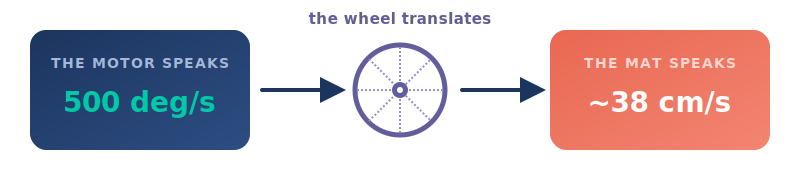
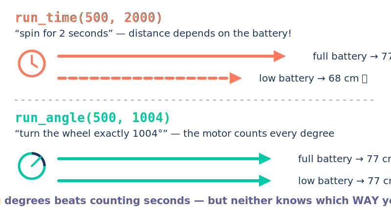
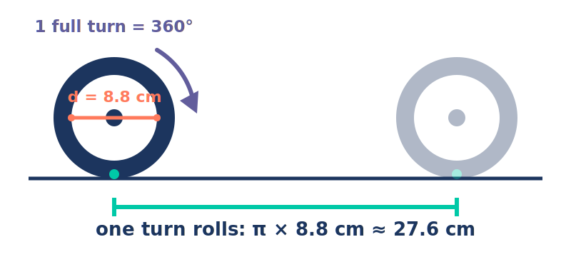

# A. Warm-Up {.sdaia-dark background-gradient="linear-gradient(135deg, #1C355E, #00C9A7)"}

Finish the builds — every robot passes the four checks.

## Before we code

- 🏗️ **Build catch-up** — didn't finish yesterday? Finish now, no penalty.
- ✅ Re-run the **four checks**: click · twin · shake · roll.
- 🔋 Battery light **green-ish**? You'll see *why* that matters today.

⏱️ **Time: 20 minutes**

# B. The Human Robot {.sdaia-dark background-gradient="linear-gradient(135deg, #1C355E, #FF7A5C)"}

Break it → feel it → fix it. Starting with **no laptops at all.**

## Unplugged: drive a blindfolded partner

::: {.callout-important}
## The game
One of you is the *programmer*; your blindfolded partner is the *robot*. Only **discrete commands** — "forward 30 cm," "turn 90° right." No steering, no touching. Get your robot across the mat to the target.
:::

- Give the commands. Watch where your "robot" *actually* ends up.
- Swap roles and run it again.

⏱️ **Time: 15 minutes**

## What just went wrong?

:::: {.columns}

::: {.column width="50%"}
**You commanded**

- forward 30 cm
- turn 90°
- forward 30 cm
:::

::: {.column width="50%"}
**The robot did**

- forward *~34* cm
- turn *~80°*
- forward 30 cm… into the wrong spot
:::

::::

. . .

::: {.cardbox .coral}
That gap is **open-loop drift** — moving without checking the result. Hold that thought: your LEGO robot is about to do *exactly* the same thing.
:::

# C. What IS Speed? {.sdaia-dark background-gradient="linear-gradient(135deg, #1C355E, #625D9C)"}

Two cars. One race. You already know the answer — now say it like a scientist.

## 🏁 The race

```{=html}
<div style="width:880px;margin:0 auto;">
  <div style="display:flex;justify-content:space-between;align-items:center;">
    <button onclick="startRace()" style="background:#00C9A7;color:#fff;border:none;border-radius:10px;padding:8px 26px;font-size:24px;font-weight:700;cursor:pointer;">🏁 Race!</button>
    <div style="font-size:26px;font-weight:800;color:#1C355E;">⏱ <span id="raceClock">0.0</span> s</div>
  </div>
  <div style="position:relative;height:62px;background:#eef3f8;border-radius:12px;margin-top:12px;">
    <span id="carA" style="position:absolute;left:4px;top:6px;font-size:42px;display:inline-block;transform:scaleX(-1);">🚗</span>
    <span id="lblA" style="position:absolute;left:722px;top:16px;font-size:24px;font-weight:800;color:#00C9A7;visibility:hidden;">6&nbsp;m in 3&nbsp;s</span>
  </div>
  <div style="position:relative;height:62px;background:#eef3f8;border-radius:12px;margin-top:10px;">
    <span id="carB" style="position:absolute;left:4px;top:6px;font-size:42px;display:inline-block;transform:scaleX(-1);">🚙</span>
    <span id="lblB" style="position:absolute;left:392px;top:16px;font-size:24px;font-weight:800;color:#FF7A5C;visibility:hidden;">3&nbsp;m in 3&nbsp;s</span>
  </div>
  <div id="raceRuler" style="position:relative;height:34px;margin-top:6px;border-top:3px solid #1C355E;"></div>
</div>
<script>
(function(){
  var ruler = document.getElementById('raceRuler');
  if(!ruler) return;
  for(var i=0;i<=8;i++){
    var t=document.createElement('div');
    t.style.cssText='position:absolute;top:0;width:2px;height:10px;background:#1C355E;left:'+(4+i*110)+'px';
    ruler.appendChild(t);
    var l=document.createElement('div');
    l.style.cssText='position:absolute;top:12px;font-size:17px;color:#1C355E;left:'+(4+i*110-12)+'px';
    l.textContent=i+' m';
    ruler.appendChild(l);
  }
})();
var raceRAF=null;
function startRace(){
  if(raceRAF) cancelAnimationFrame(raceRAF);
  var A=document.getElementById('carA'), B=document.getElementById('carB'),
      c=document.getElementById('raceClock'),
      lA=document.getElementById('lblA'), lB=document.getElementById('lblB');
  A.style.left='4px'; B.style.left='4px';
  lA.style.visibility='hidden'; lB.style.visibility='hidden';
  var t0=performance.now();
  function step(now){
    var t=(now-t0)/1000; if(t>3) t=3;
    A.style.left=(220*t)+'px';
    B.style.left=(110*t)+'px';
    c.textContent=t.toFixed(1);
    if(t<3){ raceRAF=requestAnimationFrame(step); }
    else { lA.style.visibility='visible'; lB.style.visibility='visible'; raceRAF=null; }
  }
  raceRAF=requestAnimationFrame(step);
}
</script>
```

::: {.fragment .fade-up}
::: {.cardbox .purple}
Same start. Same 3 seconds. **What did you notice?**
:::
:::

::: {.fragment .fade-up}
::: {.cardbox .purple}
 …and *how much* faster is 🚗? 
:::
:::

::: {.fragment .fade-up}
::: {.cardbox .purple}
"A lot" is not a measurement.
:::
:::

::: {.notes}
Run the race two or three times. Elicit, don't tell: "What did you notice?" (Car A got farther / arrived first.) "Yes — what do we call that?" SPEED. "You're scientists now — and scientists need an *accurate* way to describe speed. Suggestions?" Guide toward: how far it went… and how long it took. The moment someone says "distance and time," celebrate it — the next slide is their idea, formalized.
:::

## Say it with numbers

:::: {.columns}

::: {.column width="50%"}
🚗 Car A: **6 m** in **3 s**

→ 6 ÷ 3 = **2 m every second**
:::

::: {.column width="50%"}
🚙 Car B: **3 m** in **3 s**

→ 3 ÷ 3 = **1 m every second**
:::

::::

::: {.fragment .fade-up}
::: {.cardbox .teal}
**speed = distance ÷ time** — how far you get, *per second*. That's the whole formula. You invented it.
:::
:::

::: {.notes}
Anchor with everyday speeds: a car does 100 km/h — 100 km of distance for every hour. Ask: what's YOUR walking speed? (~5 km/h ≈ 1.4 m/s.) Then shrink to robot scale: centimeters per second.
:::

# D. The First Program {.sdaia-dark background-gradient="linear-gradient(135deg, #1C355E, #00C9A7)"}

Import, name the motors, spin the wheels.

## Make it move LAB

```{.python code-line-numbers="|1-4|6-8|10-11"}
from pybricks.hubs import PrimeHub
from pybricks.pupdevices import Motor
from pybricks.parameters import Port, Direction
from pybricks.tools import wait

hub = PrimeHub()
left = Motor(Port.A, Direction.COUNTERCLOCKWISE)
right = Motor(Port.E)

left.run_time(500, 2000, wait=False)
right.run_time(500, 2000)
```

::: {.notes}
Walk the highlight steps live: (1) the imports pull in the hub/motor/port tools; (2) we name each motor by the port it's plugged into — the left wheel spins backward, so `left` gets `COUNTERCLOCKWISE`; (3) `run_time(500, 2000)` runs the motor for 2000 ms, and `wait=False` lets the left motor start *while* the right one is told to go, so both move together. Don't explain the 500 yet — they just defined speed, and the next slide interrogates it.
:::

# Game Day 🎮 {.sdaia-dark background-gradient="linear-gradient(135deg, #1C355E, #FF7A5C)"}

Yesterday you made it move. Today you make it *obey* — with the one tool you already own: `run_time`.

## 🐛 Bug hunt

::: {.qbox}
[This program **crashes before the robot twitches**. Find the crime.]{.qtitle}
:::

```python
from pybricks.parameters import Port, Direction

left = Motor(Port.A, Direction.COUNTERCLOCKWISE)
right = Motor(Port.E)

left.run_time(500, 2000, wait=False)
right.run_time(500, 2000)
```

::: {.fragment .fade-up}
::: {.cardbox .coral}
`NameError: name 'Motor' is not defined` — we never **imported** `Motor`. Python only knows the tools you pull in: `from pybricks.pupdevices import Motor`.
:::
:::

::: {.notes}
Run each buggy program live on one robot if possible — the error message on screen is the payoff. Teams shout the line number, not the fix, first. Reading broken code is far less scary than writing fresh code; that's the whole point of this warm-up.
:::

## 🐛 Bug hunt

::: {.qbox}
[The imports are perfect… and it *still* crashes. Why?]{.qtitle}
:::

```python
from pybricks.pupdevices import Motor
from pybricks.parameters import Port, Direction

left = Motor(Port.A, Direction.COUNTERCLOCKWISE)
right = Motor(Port.B)

left.run_time(500, 2000, wait=False)
right.run_time(500, 2000)
```

::: {.fragment .fade-up}
::: {.cardbox .coral}
`OSError` — the code says **Port B**, but the right motor is plugged into **Port E**. The program must match the *physical* robot. Check the cable, then check the letter.
:::
:::


## 🥌 Game 1: Robot Curling

::: {.callout-important}
## The rules
Tape three zones on the floor: **10 pts** · **25 pts** · **50 pts bullseye**. Start behind the line, run your program, hands off. Robot must stop **fully inside** a zone — slide past the last zone and it's **0**. You may change **only one number: the `2000`**. **3 throws, best one counts.**
:::

```python
left.run_time(500, 2000, wait=False)   # ← tune ONLY the time
right.run_time(500, 2000)
```

::: {.fragment .fade-up}
::: {.cardbox .purple}
Throw 1 lands short, throw 2 with the *same number* lands somewhere else?! Keep your score sheet — that wobble is **evidence**, and we'll need it later today. 🕵️
:::
:::

⏱️ **Time: 15 minutes**

::: {.notes}
Zones at roughly 80 / 110 / 140 cm from the start line — close enough that ~2–3 s runs land in range, far enough that guessing badly is visible. Hand out the score sheet; make them write every DRIVE_TIME they try and where it stopped. That log is the raw material for the speed lab later — don't tell them yet.
:::

## 🅿️ Bonus round: The Price Is Right

::: {.callout-important}
## The rules
Park your robot's nose **as close to the wall as you can without touching it**. Touch = **0**. Judge measures the gap with a ruler — **smallest gap wins.**
:::

- Same law as curling: tune the time, nothing else.
- Pro tip: sneak up in *two* runs? Not allowed — **one program, one shot.** 😏

⏱️ **Time: 10 minutes — if the curling podium is settled**


# Break {.sdaia-dark background-gradient="linear-gradient(135deg, #1C355E, #00C9A7)"}

## Quick quiz 🚨

::: {.qbox}
[`run_time(500, 2000)` — you just defined speed… so 500 is a speed of *what*? And the 2000?]{.qtitle}

Centimeters per second? Meters? Robot points? Guess!
:::

::: {.fragment .fade-up}
::: {.cardbox .coral}
`2000` = **milliseconds** — how long it runs.
`500` = **degrees per second**. It *is* a speed — something ÷ time — but the something isn't distance… 🤔
:::
:::

::: {.notes}
Ask "what speed did you just use?" — expect silence; that's the plan. Reveal: it's a *different kind* of speed. Pybricks motor commands really do take **rotational (angular) speed in deg/s** — that's the motor's own language. The next slide makes them derive it.
:::

## ⚙️ Motors have a speed too

```{=html}
<div style="display:flex;justify-content:center;align-items:flex-start;gap:90px;">
  <div style="text-align:center;">
    <div style="font-weight:800;color:#1C355E;font-size:24px;">Motor A</div>
    <div id="discA" style="width:150px;height:150px;border:8px solid #1C355E;border-radius:50%;position:relative;margin:10px auto;background:#eef3f8;">
      <div style="position:absolute;left:50%;top:6px;width:6px;height:64px;background:#FF7A5C;margin-left:-3px;border-radius:3px;"></div>
    </div>
    <div style="font-size:22px;color:#1C355E;"><span id="rotA">0.0</span> rotations</div>
  </div>
  <div style="display:flex;flex-direction:column;justify-content:center;height:230px;">
    <button onclick="spinMotors()" style="background:#625D9C;color:#fff;border:none;border-radius:10px;padding:10px 24px;font-size:22px;font-weight:700;cursor:pointer;">▶ Spin for 3 s</button>
  </div>
  <div style="text-align:center;">
    <div style="font-weight:800;color:#1C355E;font-size:24px;">Motor B</div>
    <div id="discB" style="width:150px;height:150px;border:8px solid #1C355E;border-radius:50%;position:relative;margin:10px auto;background:#eef3f8;">
      <div style="position:absolute;left:50%;top:6px;width:6px;height:64px;background:#00C9A7;margin-left:-3px;border-radius:3px;"></div>
    </div>
    <div style="font-size:22px;color:#1C355E;"><span id="rotB">0.0</span> rotations</div>
  </div>
</div>
<script>
var spinRAF=null;
function spinMotors(){
  if(spinRAF) cancelAnimationFrame(spinRAF);
  var dA=document.getElementById('discA'), dB=document.getElementById('discB');
  var t0=performance.now();
  function step(now){
    var t=(now-t0)/1000; if(t>3) t=3;
    var aA=360*t, aB=120*t;
    dA.style.transform='rotate('+aA+'deg)';
    dB.style.transform='rotate('+aB+'deg)';
    document.getElementById('rotA').textContent=(aA/360).toFixed(1);
    document.getElementById('rotB').textContent=(aB/360).toFixed(1);
    if(t<3){ spinRAF=requestAnimationFrame(step); } else { spinRAF=null; }
  }
  spinRAF=requestAnimationFrame(step);
}
</script>
```

::: {.fragment .fade-up}
::: {.cardbox .purple}
No road, no distance — so count what a motor *does*: **turns**. Spin speed = **rotations ÷ time**. Same recipe, new ingredient.
:::
:::

::: {.notes}
Elicit: "This is a motor — how can we measure how fast it is?" Expect "rotations per second" — agree enthusiastically. Don't reveal degrees yet! Ask: "But what if I want to spin only *half* a turn? Or a *quarter*?" — let them sit with that before the next slide.
:::

## 🧭 What about half a rotation? A quarter?

```{=html}
<div style="display:flex;justify-content:center;align-items:flex-start;gap:60px;flex-wrap:wrap;">

  <!-- Degree dial -->
  <div style="text-align:center;">
    <svg id="dialSVG" width="240" height="240" viewBox="-120 -120 240 240" style="display:block;margin:0 auto;">
      <!-- tick marks -->
      <g id="ticks"></g>
      <!-- arc fill -->
      <path id="arcFill" d="" fill="none" stroke="#625D9C" stroke-width="14" stroke-linecap="round"/>
      <!-- disc -->
      <circle cx="0" cy="0" r="88" fill="#eef3f8" stroke="#1C355E" stroke-width="8"/>
      <!-- needle -->
      <line id="dialNeedle" x1="0" y1="0" x2="0" y2="-72" stroke="#FF7A5C" stroke-width="7" stroke-linecap="round"/>
      <circle cx="0" cy="0" r="8" fill="#1C355E"/>
    </svg>
    <div style="font-size:28px;font-weight:800;color:#625D9C;margin-top:6px;">
      <span id="dialDeg">0</span>°
    </div>
    <div style="font-size:18px;color:#1C355E;margin-top:2px;">
      = <span id="dialFrac">0</span> rotation
    </div>
  </div>

  <!-- buttons -->
  <div style="display:flex;flex-direction:column;gap:12px;justify-content:center;">
    <button onclick="setDial(0)"   style="background:#eef3f8;color:#1C355E;border:2px solid #1C355E;border-radius:10px;padding:10px 28px;font-size:20px;font-weight:700;cursor:pointer;">0°</button>
    <button onclick="setDial(90)"  style="background:#eef3f8;color:#1C355E;border:2px solid #1C355E;border-radius:10px;padding:10px 28px;font-size:20px;font-weight:700;cursor:pointer;">90° — ¼ turn</button>
    <button onclick="setDial(180)" style="background:#eef3f8;color:#1C355E;border:2px solid #1C355E;border-radius:10px;padding:10px 28px;font-size:20px;font-weight:700;cursor:pointer;">180° — ½ turn</button>
    <button onclick="setDial(270)" style="background:#eef3f8;color:#1C355E;border:2px solid #1C355E;border-radius:10px;padding:10px 28px;font-size:20px;font-weight:700;cursor:pointer;">270° — ¾ turn</button>
    <button onclick="setDial(360)" style="background:#625D9C;color:#fff;border:none;border-radius:10px;padding:10px 28px;font-size:20px;font-weight:700;cursor:pointer;">360° — full turn</button>
  </div>
</div>

<script>
(function(){
  // draw tick marks at 0,30,60,...360
  var tg = document.getElementById('ticks');
  [0,30,60,90,120,150,180,210,240,270,300,330,360].forEach(function(d){
    var rad = (d - 90) * Math.PI / 180;
    var isMajor = (d % 90 === 0);
    var r1 = isMajor ? 94 : 97, r2 = 106;
    var x1=Math.cos(rad)*r1, y1=Math.sin(rad)*r1;
    var x2=Math.cos(rad)*r2, y2=Math.sin(rad)*r2;
    var line = document.createElementNS('http://www.w3.org/2000/svg','line');
    line.setAttribute('x1',x1); line.setAttribute('y1',y1);
    line.setAttribute('x2',x2); line.setAttribute('y2',y2);
    line.setAttribute('stroke', isMajor ? '#1C355E' : '#aab');
    line.setAttribute('stroke-width', isMajor ? 3 : 1.5);
    tg.appendChild(line);
    if(isMajor && d < 360){
      var lrad = (d-90)*Math.PI/180;
      var tx=Math.cos(lrad)*116, ty=Math.sin(lrad)*116;
      var txt = document.createElementNS('http://www.w3.org/2000/svg','text');
      txt.setAttribute('x',tx); txt.setAttribute('y',ty);
      txt.setAttribute('text-anchor','middle');
      txt.setAttribute('dominant-baseline','middle');
      txt.setAttribute('font-size','13');
      txt.setAttribute('font-weight','700');
      txt.setAttribute('fill','#1C355E');
      txt.textContent = d + '°';
      tg.appendChild(txt);
    }
  });

  var currentDeg = 0, rafId = null;

  function fracLabel(deg){
    if(deg===0)   return '0';
    if(deg===90)  return '¼';
    if(deg===180) return '½';
    if(deg===270) return '¾';
    if(deg===360) return '1';
    return (deg/360).toFixed(2);
  }

  function describeArc(deg){
    if(deg<=0) return '';
    if(deg>=360) deg=359.99;
    var rad = (deg - 90) * Math.PI / 180;
    var x = Math.cos(rad)*88, y = Math.sin(rad)*88;
    var large = deg > 180 ? 1 : 0;
    return 'M 0 -88 A 88 88 0 '+large+' 1 '+x.toFixed(2)+' '+y.toFixed(2);
  }

  window.setDial = function(target){
    if(rafId) cancelAnimationFrame(rafId);
    var start = currentDeg, duration = 500, t0 = performance.now();
    function animate(now){
      var p = Math.min((now-t0)/duration, 1);
      var ease = p<0.5 ? 2*p*p : -1+(4-2*p)*p;
      var deg = start + (target-start)*ease;
      currentDeg = deg;
      var rad = (deg-90)*Math.PI/180;
      document.getElementById('dialNeedle').setAttribute('x2', (Math.sin(deg*Math.PI/180)*72).toFixed(2));
      document.getElementById('dialNeedle').setAttribute('y2', (-Math.cos(deg*Math.PI/180)*72).toFixed(2));
      document.getElementById('arcFill').setAttribute('d', describeArc(deg));
      document.getElementById('dialDeg').textContent = Math.round(deg);
      document.getElementById('dialFrac').textContent = fracLabel(Math.round(deg));
      if(p<1){ rafId=requestAnimationFrame(animate); } else { currentDeg=target; rafId=null; }
    }
    rafId=requestAnimationFrame(animate);
  };
})();
</script>
```

::: {.fragment .fade-up}
::: {.cardbox .teal}
**0, 30, 60, 90 … 360** — ancient sky-watchers sliced a full circle into **360 equal steps** called **degrees**. The idea comes from the **Babylonians** (~2000 BCE), who loved multiples of 60. The Greeks inherited and spread it, and we are still using it today! 🏛️
:::
:::

::: {.notes}
Ask: "If I want *exactly* half a turn, how do I write that as a number of full rotations?" (0.5 — messy fractions ahead!) Reveal: that's why we use degrees. Walk through the dial: 90° = quarter, 180° = half, 360° = full. Then fun history: Babylonians, base-60, ~360 days in a year — they made 360 the magic number. Greeks (Hipparchus, Ptolemy) adopted and spread it. LEGO engineers still follow that 4000-year-old choice.
:::

## Name your numbers — variables

```{.python code-line-numbers="|1-2|4-5"}
DRIVE_SPEED = 500   # deg/s
DRIVE_TIME = 2000   # ms

left.run_time(DRIVE_SPEED, DRIVE_TIME, wait=False)
right.run_time(DRIVE_SPEED, DRIVE_TIME)
```

::: {.cardbox .teal}
Name a number once → change it in **one place** → every move retunes. First habit of clean robot code.
:::

# E. The Wheel Is a Translator {.sdaia-dark background-gradient="linear-gradient(135deg, #1C355E, #625D9C)"}

The mat speaks **cm**. The motor speaks **degrees**. Someone has to translate.

## 🎯 Mission: drive *exactly* 100 cm

::: {.qbox}
[Your robot only listens to **deg/s** and **ms**. How do you order it to travel **100 cm**?]{.qtitle}

Think: what's the only part of the robot that actually *touches* the mat?
:::

::: {.fragment .fade-up}
::: {.cardbox .purple}
The **wheel** 🛞 — every degree the motor turns becomes distance on the ground. Let's see exactly how much.
:::
:::

## 🛞 Unroll the wheel

```{=html}
<div style="width:880px;margin:0 auto;text-align:center;">
<svg id="unrollSVG" viewBox="0 0 880 430" style="width:880px;height:430px;" xmlns="http://www.w3.org/2000/svg">
  <text x="30" y="34" font-size="23" fill="#1C355E" font-weight="bold">Tiny wheel — rope around the rim = 8 cm</text>
  <line x1="30" y1="150" x2="850" y2="150" stroke="#c9d4e0" stroke-width="3"/>
  <line id="trace1" x1="60" y1="150" x2="60" y2="150" stroke="#00C9A7" stroke-width="9" stroke-dasharray="14 9" stroke-linecap="round"/>
  <g id="wheel1G" transform="translate(60,115)">
    <g id="wheel1R">
      <circle r="35" fill="#ffffff" stroke="#1C355E" stroke-width="7" stroke-dasharray="14 9"/>
      <line x1="0" y1="0" x2="0" y2="35" stroke="#625D9C" stroke-width="5"/>
      <circle cx="0" cy="35" r="7" fill="#FF7A5C"/>
    </g>
  </g>
  <line x1="60" y1="152" x2="60" y2="170" stroke="#1C355E" stroke-width="3"/>
  <line x1="280" y1="152" x2="280" y2="170" stroke="#1C355E" stroke-width="3"/>
  <text id="res1" x="170" y="192" text-anchor="middle" font-size="22" fill="#00C9A7" font-weight="bold" opacity="0">1 rotation = the whole rope = 8 cm</text>

  <text x="30" y="234" font-size="23" fill="#1C355E" font-weight="bold">YOUR wheel — rope around the rim ≈ 27.6 cm</text>
  <line x1="30" y1="368" x2="850" y2="368" stroke="#c9d4e0" stroke-width="3"/>
  <line id="trace2" x1="60" y1="368" x2="60" y2="368" stroke="#00C9A7" stroke-width="9" stroke-dasharray="14 9" stroke-linecap="round"/>
  <g id="wheel2G" transform="translate(60,316)">
    <g id="wheel2R">
      <circle r="52" fill="#ffffff" stroke="#1C355E" stroke-width="7" stroke-dasharray="14 9"/>
      <line x1="0" y1="0" x2="0" y2="52" stroke="#625D9C" stroke-width="5"/>
      <circle cx="0" cy="52" r="7" fill="#FF7A5C"/>
    </g>
  </g>
  <line x1="60" y1="370" x2="60" y2="388" stroke="#1C355E" stroke-width="3"/>
  <line x1="387" y1="370" x2="387" y2="388" stroke="#1C355E" stroke-width="3"/>
  <text id="res2" x="224" y="412" text-anchor="middle" font-size="22" fill="#00C9A7" font-weight="bold" opacity="0">1 rotation = the whole rope ≈ 27.6 cm</text>
</svg>
<button onclick="rollWheels()" style="background:#00C9A7;color:#fff;border:none;border-radius:10px;padding:8px 26px;font-size:22px;font-weight:700;cursor:pointer;margin-top:4px;">🛞 Roll one full turn</button>
</div>
<script>
var rollRAF=null;
function rollWheels(){
  if(rollRAF) cancelAnimationFrame(rollRAF);
  var C1=2*Math.PI*35, C2=2*Math.PI*52;
  var g1=document.getElementById('wheel1G'), r1=document.getElementById('wheel1R'), t1=document.getElementById('trace1');
  var g2=document.getElementById('wheel2G'), r2=document.getElementById('wheel2R'), t2=document.getElementById('trace2');
  var res1=document.getElementById('res1'), res2=document.getElementById('res2');
  res1.setAttribute('opacity','0'); res2.setAttribute('opacity','0');
  var t0=performance.now(), DUR=2.6;
  function step(now){
    var p=(now-t0)/1000/DUR; if(p>1) p=1;
    g1.setAttribute('transform','translate('+(60+p*C1)+',115)');
    r1.setAttribute('transform','rotate('+(p*360)+')');
    t1.setAttribute('x2', 60+p*C1);
    g2.setAttribute('transform','translate('+(60+p*C2)+',316)');
    r2.setAttribute('transform','rotate('+(p*360)+')');
    t2.setAttribute('x2', 60+p*C2);
    if(p<1){ rollRAF=requestAnimationFrame(step); }
    else { res1.setAttribute('opacity','1'); res2.setAttribute('opacity','1'); rollRAF=null; }
  }
  rollRAF=requestAnimationFrame(step);
}
</script>
```

::: {.notes}
The rim is a **rope wrapped in a circle** — rolling one turn *unfolds* the rope flat on the ground. A wheel whose rope is 8 cm travels exactly 8 cm per rotation; your big wheel's rope is ≈ 27.6 cm, so one rotation = 27.6 cm. Ask before rolling: "if the rope is 8 cm, how far does one rotation take you?" (Note: the two scenes use different zoom levels — each ruler is in its own wheel's units.)
:::

## From deg/s to cm/s

{fig-align="center" width="85%"}

:::: {.columns}

::: {.column width="55%"}
### The Translation

Since 1 full rotation is **360° = 27.6 cm**:
$$360\text{ deg/s} = 27.6\text{ cm/s}$$

::: {.fragment}
To convert any speed, we scale it:
$$\text{Speed (cm/s)} = \text{Speed (deg/s)} \times \frac{27.6}{360}$$
:::
:::

::: {.column width="45%"}
::: {.fragment}
### Practical Example 🧮


For `DRIVE_SPEED = 500`:

<div style="text-align: center; margin: 18px 0; font-size: 1.15em; font-weight: bold;">
$500 \times \frac{27.6}{360} \approx 38.3\text{ cm/s}$
</div>

**Let's check that claim!**

:::
:::

::::

## 🔬 Speed lab — measure YOUR robot

1. Put tape at the **front wheels**. Run the program: `DRIVE_SPEED = 500`, `DRIVE_TIME = 2000`.
2. Measure the distance with a ruler. **Write it down.**
3. Compute: **speed = distance ÷ 2 seconds**. Math predicted **~38 cm/s → ~77 cm**.

::: {.fragment .fade-up}
::: {.cardbox .purple}
Got *less* than 77? And your neighbor got a *different* number — same code?! (Hint: check both battery lights. 🔋) **Commanding is not the same as getting.**
:::
:::

⏱️ **Time: 15 minutes**

## So… exactly 100 cm?

::: {.qbox}
[At ~38 cm/s: time = 100 ÷ 38 ≈ **2.6 s**. Set `DRIVE_TIME = 2600`. Run it. Measure it.]{.qtitle}

Did anyone land *on* 100 cm?
:::

::: {.fragment .fade-up}
::: {.cardbox .coral}
Short again — and different every run. **Timed driving trusts the battery to keep its promise.** There has to be a better way…
:::
:::

⏱️ **Time: 10 minutes**

# F. Count Degrees, Not Seconds {.sdaia-dark background-gradient="linear-gradient(135deg, #1C355E, #00C9A7)"}

`run_angle` — the motor counts every degree for you.

## run_time vs run_angle

{fig-align="center" width="80%"}

::: {.notes}
Live demo if time allows: run the same run_time program on a full hub and a nearly-empty hub — different distances. Then run_angle on both — same distance. The encoder inside the motor counts degrees; time doesn't lie the same way twice.
:::

## 🎯 Predict-a-distance

::: {.qbox}
[You want **exactly 100 cm**. One wheel turn (360°) ≈ 27.6 cm. How many degrees?]{.qtitle}
:::

::: {.fragment .fade-up}
### 🧮 Direct Conversion

1. **Degrees per 1 cm:** &nbsp; $1\text{ cm} = \frac{360^\circ}{27.6\text{ cm}} \approx 13.04^\circ/\text{cm}$
2. **For 100 cm:** &nbsp; $\text{degrees} = 100\text{ cm} \times 13.04^\circ/\text{cm} \approx \mathbf{1304^\circ}$
:::

::: {.fragment .fade-up}
### 🤖 Try It Out

```python
# Spin left and right motors together to go 100 cm
left.run_angle(DRIVE_SPEED, 1304, wait=False)
right.run_angle(DRIVE_SPEED, 1304)
```
:::

⏱️ **Time: 10 minutes**

# G. Where Does 27.6 Come From? {.sdaia-dark background-gradient="linear-gradient(135deg, #1C355E, #625D9C)"}

Wheels don't advertise their rope — they advertise their **diameter**.

## Diameter → circumference

{fig-align="center" width="82%"}

::: {.fragment .fade-up}
::: {.cardbox .teal}
**circumference = π × diameter.** Your wheel: 3.14 × 8.8 cm ≈ **27.6 cm**. Any wheel on Earth: read the diameter off the tire, multiply by π, and you speak its language.
:::
:::

## 🧪 Bonus: discover π yourself

- Wrap a string around anything round — cup, tape roll, bottle, your wheel. That's **C**.
- Measure straight across the middle. That's **d**.
- Divide: **C ÷ d = ?**

::: {.fragment .fade-up}
::: {.cardbox .purple}
**≈ 3.14. Every. Single. Time.** That number is **π** — the circle's built-in constant. You didn't memorize it; you *discovered* it.
:::
:::

## 🧪 Bonus: another way to measure a circle

No string? Catch the circle with **straight lines** instead.

```{=html}
<div style="display:flex;justify-content:center;align-items:center;gap:70px;margin-top:10px;">
  <svg width="380" height="380" viewBox="-200 -200 400 400" xmlns="http://www.w3.org/2000/svg">
    <g class="fragment" data-fragment-index="1">
      <rect x="-150" y="-150" width="300" height="300" fill="none" stroke="#FF7A5C" stroke-width="6"/>
    </g>
    <circle r="150" fill="#eef3f8" stroke="#1C355E" stroke-width="6"/>
    <line x1="-150" y1="0" x2="150" y2="0" stroke="#625D9C" stroke-width="3" stroke-dasharray="8 6"/>
    <text x="0" y="-14" text-anchor="middle" font-size="22" font-weight="700" fill="#625D9C">d = 1</text>
    <g class="fragment" data-fragment-index="2">
      <polygon points="0,-150 150,0 0,150 -150,0" fill="none" stroke="#00C9A7" stroke-width="6"/>
    </g>
  </svg>
  <div style="text-align:left;max-width:460px;">
    <div style="font-size:27px;color:#1C355E;">A square's rope needs no π:<br><b>perimeter = 4 × side</b></div>
    <div class="fragment" data-fragment-index="1" style="font-size:27px;margin-top:24px;">
      <span style="color:#FF7A5C;font-weight:800;">Outside square:</span> 4 × 1 = <b>4</b><br>
      <span style="color:#1C355E;">→ circle's rope is <b>less than 4</b></span>
    </div>
    <div class="fragment" data-fragment-index="2" style="font-size:27px;margin-top:24px;">
      <span style="color:#00C9A7;font-weight:800;">Inside square:</span> rope ≈ <b>2.83</b><br>
      <span style="color:#1C355E;">→ circle's rope is <b>more than 2.83</b></span>
    </div>
  </div>
</div>
```

::: {.fragment .fade-up fragment-index=3}
::: {.cardbox .purple}
**2.83 < π < 4** — trapped, no string needed! A rough trap, though… how do we squeeze tighter? **More sides →**
:::
:::

::: {.notes}
Optional enrichment — no gate depends on it; skip live if time is tight and point kids to it for home. Build: squares are the shapes we *can* measure (4 × side, no π). Click 1: outside square (side = d = 1) → its rope is 4, and the circle's rope is clearly shorter. Click 2: inside square → rope ≈ 2.83, circle clearly longer. Don't derive the 2.83 (side = d/√2) — the picture is the proof. Since d = 1, rope ÷ d IS π, so the trap holds π itself. The "more sides" question is the cliffhanger into the demo.
:::

## 🧪 Bonus: Archimedes' squeeze

```{=html}
<div style="display:flex;justify-content:center;align-items:center;gap:60px;">
  <svg width="360" height="360" viewBox="-190 -190 380 380" xmlns="http://www.w3.org/2000/svg">
    <polygon id="piOuterPoly" points="" fill="none" stroke="#FF7A5C" stroke-width="5"/>
    <circle r="150" fill="#eef3f8" stroke="#1C355E" stroke-width="5"/>
    <polygon id="piInnerPoly" points="" fill="none" stroke="#00C9A7" stroke-width="5"/>
    <line x1="-150" y1="0" x2="150" y2="0" stroke="#625D9C" stroke-width="3" stroke-dasharray="8 6"/>
    <text x="0" y="-14" text-anchor="middle" font-size="20" font-weight="700" fill="#625D9C">d = 1</text>
  </svg>
  <div style="text-align:left;">
    <div style="display:flex;gap:10px;margin-bottom:18px;">
      <button class="piBtn" onclick="setPiSides(4,this)"  style="background:#eef3f8;color:#1C355E;border:2px solid #1C355E;border-radius:10px;padding:8px 18px;font-size:20px;font-weight:700;cursor:pointer;">4</button>
      <button class="piBtn" onclick="setPiSides(6,this)"  style="background:#eef3f8;color:#1C355E;border:2px solid #1C355E;border-radius:10px;padding:8px 18px;font-size:20px;font-weight:700;cursor:pointer;">6</button>
      <button class="piBtn" onclick="setPiSides(12,this)" style="background:#eef3f8;color:#1C355E;border:2px solid #1C355E;border-radius:10px;padding:8px 18px;font-size:20px;font-weight:700;cursor:pointer;">12</button>
      <button class="piBtn" onclick="setPiSides(24,this)" style="background:#eef3f8;color:#1C355E;border:2px solid #1C355E;border-radius:10px;padding:8px 18px;font-size:20px;font-weight:700;cursor:pointer;">24</button>
      <button class="piBtn" onclick="setPiSides(96,this)" style="background:#eef3f8;color:#1C355E;border:2px solid #1C355E;border-radius:10px;padding:8px 18px;font-size:20px;font-weight:700;cursor:pointer;">96</button>
    </div>
    <div style="font-size:24px;color:#1C355E;"><b><span id="piN">4</span> sides</b></div>
    <div style="font-size:30px;margin-top:14px;white-space:nowrap;">
      <span id="piLo" style="color:#00C9A7;font-weight:800;">2.8284</span>
      <span style="color:#1C355E;font-weight:700;"> &lt; π &lt; </span>
      <span id="piHi" style="color:#FF7A5C;font-weight:800;">4.0000</span>
    </div>
    <div style="font-size:20px;color:#625D9C;margin-top:10px;">real π = 3.14159…</div>
  </div>
</div>
<script>
(function(){
  function piPts(n, R, off){
    var s='';
    for(var k=0;k<n;k++){
      var a=off+k*2*Math.PI/n;
      s+=(Math.cos(a)*R).toFixed(2)+','+(Math.sin(a)*R).toFixed(2)+' ';
    }
    return s.trim();
  }
  window.setPiSides=function(n, btn){
    var r=150;
    document.getElementById('piInnerPoly').setAttribute('points', piPts(n, r, -Math.PI/2));
    document.getElementById('piOuterPoly').setAttribute('points', piPts(n, r/Math.cos(Math.PI/n), -Math.PI/2+Math.PI/n));
    document.getElementById('piLo').textContent=(n*Math.sin(Math.PI/n)).toFixed(4);
    document.getElementById('piHi').textContent=(n*Math.tan(Math.PI/n)).toFixed(4);
    document.getElementById('piN').textContent=n;
    document.querySelectorAll('.piBtn').forEach(function(b){ b.style.background='#eef3f8'; b.style.color='#1C355E'; });
    if(btn){ btn.style.background='#625D9C'; btn.style.color='#fff'; }
  };
  setPiSides(4, document.querySelector('.piBtn'));
})();
</script>
```

::: {.fragment .fade-up}
::: {.cardbox .teal}
**Archimedes** (Syracuse, ~250 BCE) did exactly this by hand — doubling up to **96 sides** — and proved **3 10/71 < π < 3 1/7**. He squeezed π out of a circle 2,200 years before calculators. 🏛️
:::
:::

::: {.notes}
Optional enrichment, self-guided at home. The inner rope (teal) is always too short, the outer (coral) always too long — the circle's rope is trapped between them, and since d = 1 the trap holds π itself. Click 4 → 96 and watch both numbers march toward 3.14159. At 96 sides the trap is 3.1410–3.1427 — Archimedes' actual stopping point. Connect back: the Babylonians gave us degrees, Archimedes gave us π — both live inside every wheel calculation the robot does.
:::

# H. Competition & Gate {.sdaia-dark background-gradient="linear-gradient(135deg, #1C355E, #00C9A7)"}

Today's showdown: **Radar Gun** 🔫

## Radar Gun 📡

::: {.callout-important}
## The challenge
**Predict, then prove.** Measure your robot's speed, then tell the judge *exactly* how many seconds it needs to cross the **1.5 m** finish line. Judge starts the stopwatch — closest prediction wins. 3 attempts, best counts.
:::

- Pure science: measure → calculate → predict → test.
- Pro move: does your prediction survive a battery swap? 😏

## Today's gate

::: {.callout-important}
## You're done today when…
Your robot **moves with named variables**, you can convert **deg/s → cm/s** for your wheel, and you can **explain why counted degrees beat timed seconds**.
:::

::: {.fragment .fade-up}
Next: *Drive a Square* — meet the **gyro**, a hidden sense you'll *feel* with your own hands, and watch it snap tomorrow's open-loop square shut.
:::

## Tonight's mission 🎬 {.sdaia-dark background-gradient="linear-gradient(135deg, #1C355E, #FF7A5C)"}

::: {.r-fit-text}
You made it move. You measured it like a scientist.
:::

**Optional at home:** WRO-Learn — [*Fundamentals of Mechanics*](https://wro-learn.org/en_us/course/48) (short videos — pure enrichment; everything you need is delivered in class).
